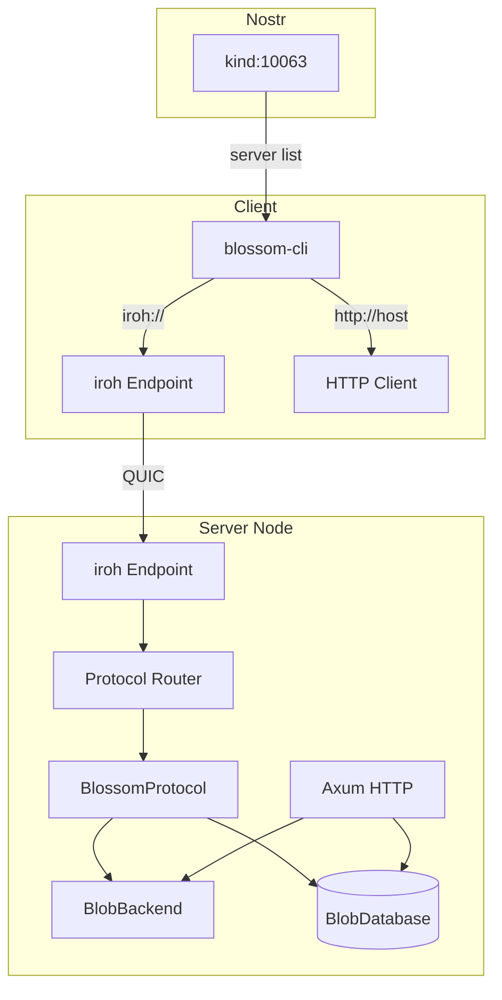
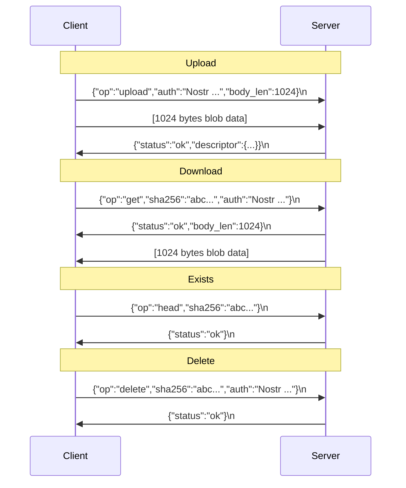
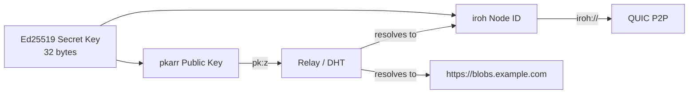

# Blossom × iroh Transport

P2P blob storage over iroh QUIC connections, addressed by node ID.

## Architecture



## Wire Protocol

ALPN: `b"/blossom/1"`

Each bidirectional QUIC stream carries one request + response. The framing
uses a JSON header line (human-readable, debuggable) followed by optional
binary payload (zero-copy for large blobs).



### Operations

| Op | Request fields | Response |
|----|---------------|----------|
| `get` | `sha256`, `auth` | status + body_len + blob bytes |
| `head` | `sha256` | status only |
| `upload` | `auth`, `content_type`, `body_len` + blob bytes | status + descriptor JSON |
| `delete` | `sha256`, `auth` | status |
| `list` | `pubkey`, `auth` | status + body_len + JSON array |

### Status codes

| Status | Meaning |
|--------|---------|
| `ok` | Success |
| `not_found` | Blob doesn't exist |
| `unauthorized` | Auth missing or invalid |
| `forbidden` | Access denied |
| `error` | Server error (check `error` field) |

## Server Setup

```rust
use blossom_rs::transport::{BlossomProtocol, IrohState, BLOSSOM_ALPN};
use iroh::protocol::Router;

// Create shared state (same BlobBackend/BlobDatabase as HTTP server)
let state = Arc::new(Mutex::new(IrohState {
    backend: Box::new(backend),
    database: Box::new(database),
    base_url: "iroh://mynode".to_string(),
}));

// Bind iroh endpoint with persistent secret key
let secret_key = load_or_generate_key("iroh_secret.key");
let endpoint = iroh::Endpoint::builder(iroh::endpoint::presets::N0)
    .secret_key(secret_key)
    .bind()
    .await?;

println!("Node ID: {}", endpoint.id());

// Start accepting connections
let _router = Router::builder(endpoint)
    .accept(BLOSSOM_ALPN.to_vec(), Arc::new(BlossomProtocol::new(state)))
    .spawn();
```

### blossom-server CLI

```bash
# Start with iroh alongside HTTP
cargo run -p blossom-server -- --iroh

# The server prints the node ID on startup:
# iroh P2P transport enabled — connect with: iroh://<node-id>
```

## Client Usage

```rust
use blossom_rs::transport::IrohBlossomClient;

let endpoint = iroh::Endpoint::builder(iroh::endpoint::presets::N0)
    .bind()
    .await?;
let client = IrohBlossomClient::new(endpoint, signer);

// Connect by node ID
let addr = "iroh://<node-id>".parse()?;

let desc = client.upload(addr.clone(), data).await?;
let blob = client.download(addr.clone(), &sha256).await?;
let exists = client.exists(addr.clone(), &sha256).await?;
let deleted = client.delete(addr, &sha256).await?;
```

### blossom-cli

```bash
# Upload via iroh
blossom-cli -s iroh://<node-id> -k <key> upload photo.jpg

# Download
blossom-cli -s iroh://<node-id> -k <key> download <sha256> output.jpg

# The CLI auto-detects iroh:// vs http:// from the --server URL
```

## Node ID Persistence

The server stores its iroh secret key at `--iroh-key-file` (default: `./iroh_secret.key`).
This 32-byte file determines the node ID — same key = same ID across restarts.

If the file doesn't exist, a new key is generated automatically.

## Nostr Integration (kind:10063)

Publish the node ID in a Nostr kind:10063 server list event:

```json
{
  "kind": 10063,
  "tags": [
    ["server", "https://blobs.example.com"],
    ["server", "iroh://<node-id>"]
  ]
}
```

Clients check for `iroh://` scheme in the server list and dial directly
when available, falling back to HTTP.

## Auth

The iroh transport reuses the same Nostr auth as HTTP:
- **kind:24242** (Blossom auth) — action tags: upload, get, delete
- **kind:27235** (NIP-98 HTTP auth) — URL and method tags

The auth event is sent as base64 in the request's `auth` field.
The server verifies it using the same `verify_blossom_auth` / `verify_nip98_auth`
functions as the HTTP handler — zero duplication.

## Key Constraints

1. **SHA256 stays canonical** — iroh internally uses BLAKE3 for its own data, but
   Blossom blobs are stored by SHA256 hash in your BlobBackend, unchanged.

2. **Connection caching** — iroh QUIC connections are cheap to keep alive. The client
   currently opens a new connection per operation; production use should cache connections.

3. **Relay fallback** — `presets::N0` uses n0's public relay servers for NAT traversal.
   For production, run your own relay or use `presets::DEFAULT` with a custom relay map.

4. **Feature flag** — `iroh-transport` is opt-in. Without it, the transport module
   only contains the wire protocol codec (no iroh dependency).

## PKARR Discovery

Enable with `features = ["pkarr-discovery"]` (implies `iroh-transport`).

Uses the **same Ed25519 secret key** as iroh — one keypair, dual identity:



### Published DNS records

```
_blossom  TXT  "https://blobs.example.com"
_iroh     TXT  "<iroh-node-id>"
```

### Usage

```rust
use blossom_rs::transport::pkarr_discovery::{PkarrPublisher, PkarrConfig};

let publisher = PkarrPublisher::new(&secret_key_bytes, PkarrConfig {
    http_url: Some("https://blobs.example.com".into()),
    iroh_node_id: Some(node_id.to_string()),
    ..Default::default()
});

// Publish once
publisher.publish().await?;

// Or spawn background republish loop (every 60min)
Arc::new(publisher).spawn_republish_loop();

// Resolve someone else's endpoints
let pk: pkarr::PublicKey = "z...".parse()?;
let (http_url, iroh_id) = resolve_blossom_endpoints(&pk).await?;
```

### DHT vs Relay

Currently uses **pkarr relays** (HTTP-based) rather than direct Mainline DHT.
The relays forward records to DHT peers, so records are still globally
discoverable. Direct DHT support (`pkarr` `dht` feature) is blocked by a
transitive `digest` crate version conflict between pkarr's `mainline` dep
and iroh 0.97. This is a one-line fix once both crates align on the same
`digest` pre-release version.
